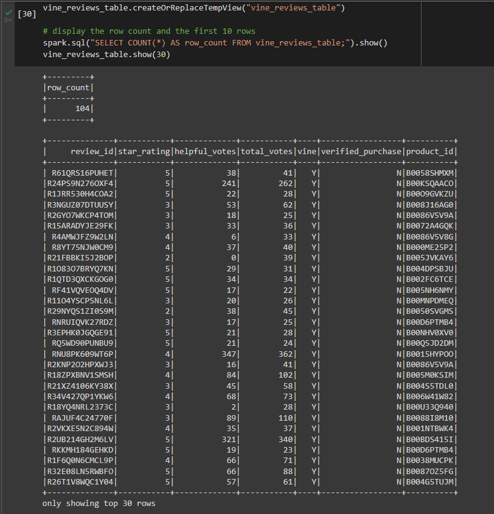
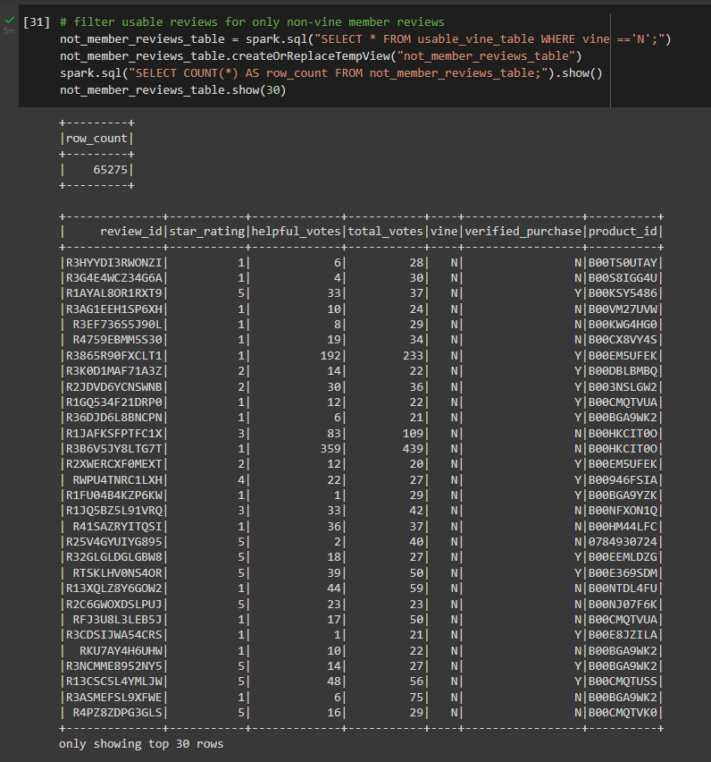

# Amazon_Vine_Analysis

The Amazon Vine program allows manufacturers to pay a fee and provide products to Amazon Vine members in exchange for reviews. The purpose of this project is to determine if there is a favorable bias in those Vine reviews.

## Tools:
 - Google Colabratory
 - Amazon Web Services (AWS)
 - pgAdmin 4, PostgresSQL 13.7
 - Datasource: Video Game Reviews from <a href="https://s3.amazonaws.com/amazon-reviews-pds/tsv/index.txt">Amazon Reviews Datasets</a>

## Overview 
Amazon_Reviews_ETL.ipynb was written in Google Colab with PySpark. Amazon data was first loaded to a Spark DataFrame, then transformed to match schema set up by pgAdmin, and finally written to the RDS instance on AWS. This notebook is also available as an HTML file.     
    
Vine_Review_Analysis.ipynb was also written in Google Colab with PySpark. After data was retrieved from the SQL Database and converted to a spark dataframe, it was transformed to keep relevant columns, filtered, and analyzed to calculate the percentage of vine vs non-vine reviews. This notebook is also available as an HTML file.

### A look at the paid reviews
 
  
  
### A look at the unpaid reviews

   
## Results: Paid vs Unpaid

- There are significantly more reviews by non-vine members than reviews by vine members.  
- Of the 14319 products in the dataset
    - 14249 products have no paid reviews
    - 19 products have only paid reviews
    - 51 products have reviews from both categories.

 - 1785997 reviews in total
     - 1026924 of those reviews are 5 stars: 99.84% are unpaid,  0.16% are paid
     - 69k+ reviews were voted helpful, heavily favoring the unpaid reviews (99.9%)

### There is no clear bias towards paid reviews.
